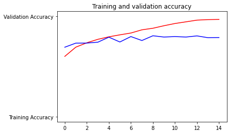
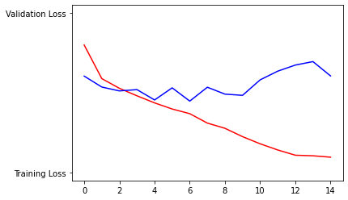
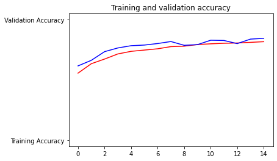
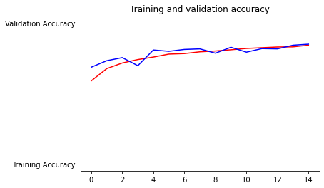
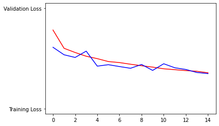

# Dogs-vs-Cats-Classifier
Optimized accuracy of CNN when classifying images of cats and dogs

## Overview

Code provided by a YouTube tutorial was improved upon using dropout and augmentation methods. It was found that augmentation by itself performed better than augmentation and dropout combined. This corroborates previous research findings.

## Results

### Results of Tutorial

### Results Using Augmentation AND Dropout

### Results Using Augmentation Only

